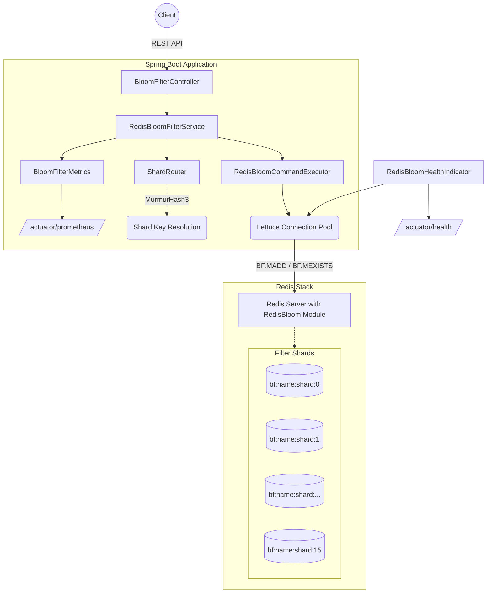
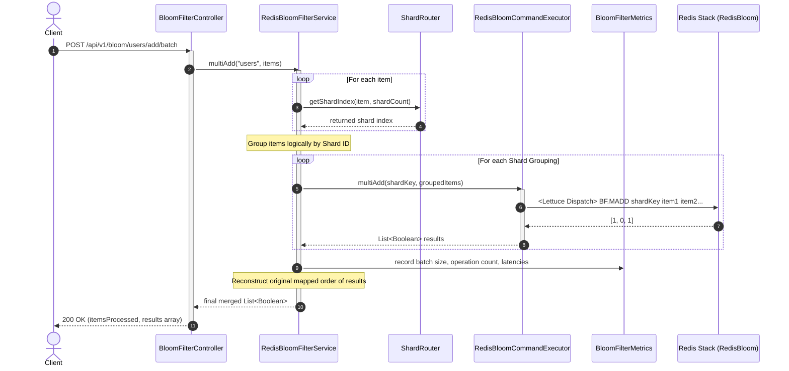

# 🚀 High-Performance Distributed Redis Bloom Filter

A production-grade, horizontally scalable, and highly observable Bloom Filter system built on **Spring Boot 4.0.5**, utilizing the **Lettuce** Redis client and the **RedisBloom** module.

This system is designed specifically to handle **billions of requests** with sub-millisecond latency. It features automatic sharding, batch operations, thread-safe components, and comprehensive metrics.

---

## 🏗️ Architecture

The system uses a sharded architecture to distribute items across multiple Redis keys, preventing single-key memory bottlenecks and allowing horizontal scalability in a Redis Cluster.



### 🔍 Detailed Execution Flow

The sequence diagram below displays how the codebase handles complex batch inputs (like `BF.MADD` and `BF.MEXISTS`), grouping them logically by shard to minimize network overhead and ensure highly concurrent execution:



---

## ✨ Key Features

- **🚀 Massive Scale Ready:** Implements horizontal sharding using an optimized `MurmurHash3` algorithm to distribute massive payloads across multiple Redis keys.
- **⚡ High Throughput:** Utilizes Lettuce's connection pooling and batch RedisBloom commands (`BF.MADD`, `BF.MEXISTS`) for high-speed bulk ingestion and verification.
- **🛡️ Resilience:** Engineered with robust error handling, Global Exception intercepts, and isolated module execution.
- **📊 Deep Observability:** Integrated with Spring Actuator and Micrometer. Tracks exact timer latencies, errors, batch sizes, and existence rates via Prometheus. Includes custom health indicator for RedisBloom module status and shard integrity.
- **⚙️ Auto-Configuration:** Automatically reserves new Bloom Filters on startup based on `application.yml` definitions.

---

## 📂 Codebase Structure

```text
src/main/java/com/bloomfilter/bloomfilter/
├── BloomfilterApplication.java           # Main application entrypoint
├── config/                               # Spring Configuration
│   ├── BloomFilterAutoConfiguration.java # Bootstraps configured filters on startup
│   ├── BloomFilterProperties.java        # Binds application.yml configuration
│   └── RedisConfig.java                  # Configures Lettuce Connection Pool
├── controller/                           # REST API Layer
│   └── BloomFilterController.java        # Handles HTTP traffic & validation
├── dto/                                  # Data Transfer Objects
│   ├── BloomFilterInfo.java              # Filter statistics payload
│   ├── BloomFilterRequest.java           # Incoming requests payload
│   └── BloomFilterResponse.java          # API Responses & aggregated info
├── exception/                            # Error Handling
│   ├── BloomFilterException.java         # Base domain exception
│   ├── BloomFilterNotFoundException.java # 404 Entity missing
│   ├── GlobalExceptionHandler.java       # @ControllerAdvice structured responses
│   └── RedisBloomModuleException.java    # Missing module handler
├── hash/                                 # Hashing Algorithms
│   └── MurmurHash3.java                  # 128-bit hash function for uniform sharding
├── health/                               # Application Health
│   └── RedisBloomHealthIndicator.java    # /actuator/health provider for RedisBloom
├── metrics/                              # Observability
│   └── BloomFilterMetrics.java           # Micrometer Timers and Counters
├── redis/                                # Redis Interaction layer
│   ├── BloomFilterCommand.java           # ProtocolKeyword custom commands
│   └── RedisBloomCommandExecutor.java    # Raw Lettuce command dispatch (Add, MAdd, etc)
├── service/                              # Business Logic
│   ├── BloomFilterService.java           # Interface definition
│   └── RedisBloomFilterService.java      # Shard-aware implementation handling routing
└── shard/                                # Sharding Logic
    └── ShardRouter.java                  # Determines shard mapping based on keys
```

---

## 🧠 How Sharding Works

Redis keys top out at 512MB, but long before that, large single keys can cause performance bottlenecks in Redis clusters (hot keys).

1. The application divides the total required `capacity` across `N` shards (configured per filter).
2. For an item (e.g., `"user_123"`), the `ShardRouter` calculates an optimized 32-bit `MurmurHash3` hash.
3. The hash assigns the item deterministically to a shard (e.g., `bf:users:shard:4`).
4. **Batching:** When you submit 10,000 items in a batch, the `RedisBloomFilterService` groups the items by their target shards and executes concurrent `BF.MADD` calls for each shard.

---

## 🚀 Getting Started

### Prerequisites
- **Java 17+**
- **Docker & Docker Compose** (for Redis Stack with the Bloom filter module)
- **Maven** (bundled wrapper included)

### 1. Start Redis Stack
The system **requires** the `RedisBloom` module, which is included in the Redis Stack image.
```bash
docker compose up -d
```

### 2. Run Tests
The repository includes comprehensive unit and integration tests under `src/test/java/`. E2E tests automatically spin up their own ephemeral Redis nodes using Testcontainers.
```bash
# Run all tests
./mvnw clean test
```

### 3. Run the Application
```bash
./mvnw spring-boot:run
```
The application will start on `http://localhost:8080`.

---

## ⚙️ Configuration

Configure the Bloom filters in `src/main/resources/application.yml`:

```yaml
bloom-filter:
  key-prefix: bf
  # Global defaults
  default-capacity: 1000000000  # 1 Billion items
  default-error-rate: 0.001     # 0.1% false positive probability
  default-shard-count: 16       # Number of physical Redis keys to split the filter across
  batch-size: 10000             # Chunk size for multi-add commands
  auto-reserve: true            # Automatically create filters listed below on app boot

  # Individual filters
  filters:
    users:                     
      capacity: 5000000000      # 5 Billion items
      error-rate: 0.0001        # 0.01% error rate
      shard-count: 32           # 32 Shards
    posts:
      # Will inherit default-capacity, default-error-rate
      shard-count: 8
```

---

## 🔌 API Reference

Base path: `/api/v1/bloom/{filterName}`

| Method | Endpoint | Description |
|---|---|---|
| **POST** | `/api/v1/bloom/{name}` | Manually create a new bloom filter with custom parameters. |
| **POST** | `/api/v1/bloom/{name}/add` | Add a single item to the filter. |
| **POST** | `/api/v1/bloom/{name}/add/batch` | Bulk add items to the filter. Extremely fast. |
| **GET** | `/api/v1/bloom/{name}/exists/{item}` | Check if an item exists. Returns true (might exist) or false (definitely absent). |
| **POST** | `/api/v1/bloom/{name}/exists/batch` | Bulk check items. |
| **GET** | `/api/v1/bloom/{name}/info` | Retrieve aggregated memory usage, capacity, and shard spread. |
| **DELETE** | `/api/v1/bloom/{name}` | Delete all shards backing the filter. |

### Example Uses

**1. Batch Add**
```bash
curl -X POST http://localhost:8080/api/v1/bloom/users/add/batch \
  -H "Content-Type: application/json" \
  -d '{"items": ["tapesh_199", "jane_doe", "john_smith"]}'
```

**2. Check Existence**
```bash
curl http://localhost:8080/api/v1/bloom/users/exists/tapesh_199
```
*Response:*
```json
{
  "filterName": "users",
  "result": true,
  "mightExist": true,
  "message": "Item MIGHT exist in filter (possible false positive)"
}
```

---

## 👀 Observability

### Health Check
`http://localhost:8080/actuator/health` provides visibility into the module:
```json
{
  "status": "UP",
  "components": {
    "bloomFilter": {
      "status": "UP",
      "details": {
        "redisBloom": "Available",
        "configuredFilters": 2,
        "filters": {
          "users": {
            "totalShards": 32,
            "activeShards": 32,
            "healthy": true
          }
        }
      }
    }
  }
}
```

### Metrics (Prometheus)
Navigate to `http://localhost:8080/actuator/prometheus` to scrape metrics:

| Metric Name | Type | Description |
|---|---|---|
| `bloom.filter.add.records` | Counter | Total number of items added (labeled by filter). |
| `bloom.filter.exists.checks` | Counter | Total number of checks, labeled by filter and `result=hit/miss`. |
| `bloom.filter.operation.latency` | Timer | Duration of operations across Lettuce. |
| `bloom.filter.batch.size` | Histogram | Distribution of chunk sizes utilized during MADD calls. |
